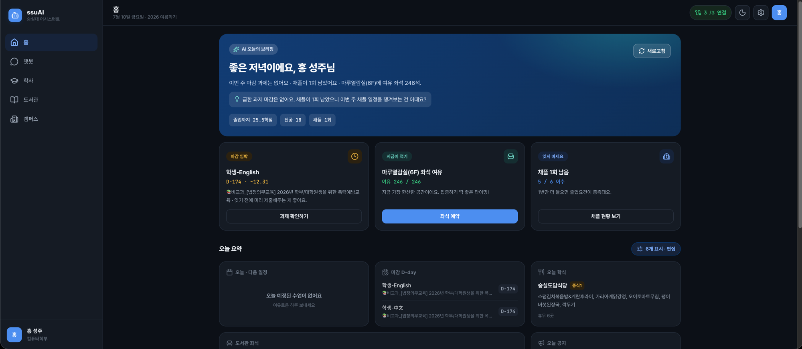
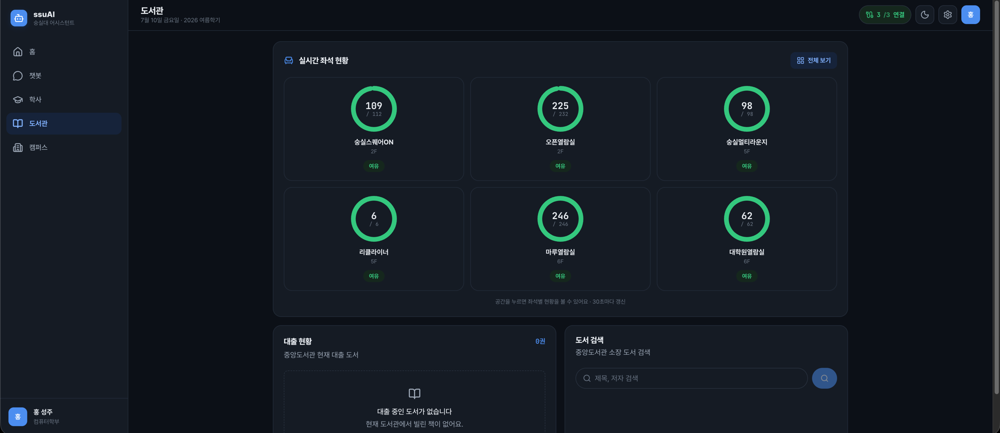
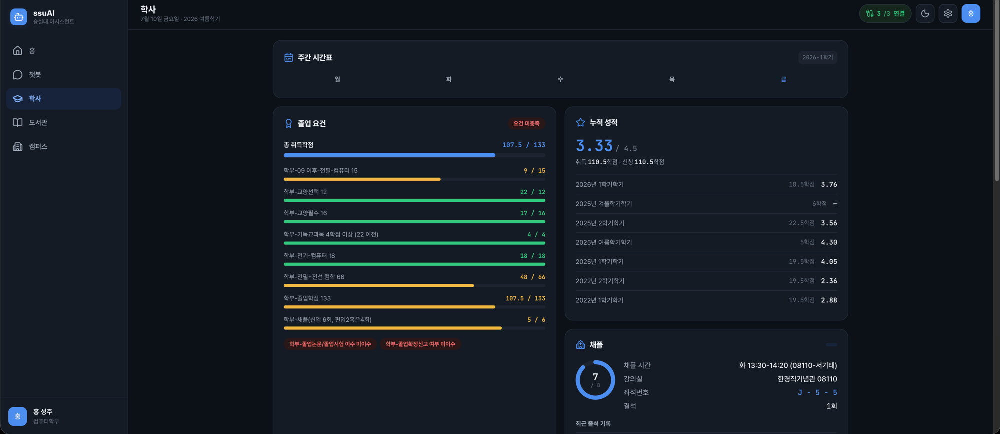

# ssuAI — Soongsil University AI Web Client

[](https://github.com/ghdtjdwn/ssuAI/actions/workflows/ci.yml)

**한국어** [README.md](README.md) · **English** (this document)

A Next.js web client for [ssuMCP](https://github.com/ghdtjdwn/ssuMCP), the Soongsil University MCP server.
Five screens (Home · Chatbot · Academics · Library · Campus) plus a natural-language chatbot for browsing public campus information and personal academic records.

| | URL |
|--|-----|
| Home (AI briefing + customizable widgets) | <https://ssuai.vercel.app/> |
| Chatbot | <https://ssuai.vercel.app/chat> |
| Academics | <https://ssuai.vercel.app/academics> |
| Library | <https://ssuai.vercel.app/library> |
| Campus | <https://ssuai.vercel.app/campus> |

---

## Screens (full redesign on 2026-07-02 — [ADR 0010](docs/adr/0010-ui-redesign.md) (Korean))

On top of a single design system (Soongsil blue + mint tokens, Pretendard/JetBrains Mono, system-following dark mode), only the layout branches: sidebar + multi-column on desktop, bottom tab bar + single column on mobile.

- **Home** — AI daily-briefing hero (a summary built from linked data) · 3 priority cards · customizable grid of 14 widgets (order/size/visibility/density, persisted in localStorage)
- **Chatbot** — SSE streaming + HITL approval cards (state-changing actions such as reservations run only after approval)
- **Academics** — weekly timetable grid · graduation requirements · grades · chapel · scholarships · LMS assignments (u-SAINT login)
- **Library** — real-time seats in 3 views (donut overview / rooms / full map) · seat recommendation → reservation · waitlist registration · loans · book search
- **Campus** — cafeteria menu (today/weekly) · dormitory menu · notices (category filter) · facility search · entry point to AI evidence search

> Home, Academics, and Library previews below are post-redesign captures. Chatbot and Campus captures are still pending.



| Real-time library seat status (donut grid) | Academics — graduation requirements · cumulative grades · chapel |
|---|---|
|  |  |

> In the chatbot, actions that change university state — e.g. *"Reserve a library seat for me"* — require login and one more confirmation through an HITL approval card before they run.

---

## Why I Built It

[ssuMCP](https://github.com/ghdtjdwn/ssuMCP) already serves university data as an MCP server, but it had to be usable by people without Claude Desktop. ssuAI is the answer: a chatbot and dashboard reachable straight from the browser, turning ssuMCP into something anyone can use as its web client.

---

## Architecture

```
Browser
   ├─ public GET/SSE ────────────────┐
   │                                  ▼
   │               ssuMCP (Spring Boot, https://ssumcp.duckdns.org)
   │                                  │ REST API
   │                                  ▼
   │               University systems (cafeteria · library · LMS · u-SAINT)
   │                                  ▲
   └─ auth/session /api/* · /api/agent/* (same-origin)
       ▼
      Next.js server (Vercel)
       ├─ /api/*        → rewrites ─────────────────┘
       └─ /api/agent/*  → proxy (injects X-Agent-Key) → ssuAgent
                                                       │ MCP
                                                       └──────────→ ssuMCP
```

The browser calls the backend origin directly only for anonymous public reads (meals, dorm meals, notices, facilities, academic calendar, library seat status/book search) and public seat SSE (ADR 0087). SmartID/LMS Bearer, refresh cookies, library session, reservations/loans, MCP web session, and `/api/agent/*` chatbot streams stay on the same-origin proxy path. Backend CORS is open only on public GET/SSE endpoints with credentials disabled, so API keys, agent keys, and sessions do not move to cross-origin browser calls.

---

## Features

### Public lookups (no login required)

- Student cafeteria and dormitory menus (today / by date / weekly)
- Campus facility search
- Central library book search
- University and department notices (list, search, detail, ongoing notices)

### Personal lookups after linking

| Link | Features |
|------|------|
| SAINT (SmartID SSO) | timetable, grades, chapel attendance, graduation requirements, scholarships |
| LMS (Canvas SSO) | assignment and quiz list |
| Library | per-floor seat availability, my current loans |

### Chatbot

Ask natural-language questions over the same data the dashboard covers. Public questions are answered immediately; personal-data questions are answered only when a linked session exists.

`/chat` connects to the LangGraph-based multi-agent (ssuAgent) over SSE streaming. Agent handoffs, tool executions, and text appear in real time, and actions that change university state — like library reservations — pause at an HITL approval card (HitlCard) and resume through `/agent/resume` after the user approves.

### Library seat reservation (flagship)

Seat reservation, seat swap, and return bring the backend MCP's two-step `prepare_* → confirm_action` confirmation directly into the UI:

- `SeatRecommendationPanel` — the 5 recommended seats for the selected floor, with a reserve button per seat
- `ReservationConfirmModal` — shows the `prepare` summary and expiry time; the user must confirm once more before `confirm` is called. The confirm result branches into `SUCCESS` (reservation complete) / `PROCESSING` (the synchronous confirm timed out but a backend worker keeps processing the reservation in the background — shown as "processing in the background", not treated as a failure) / other failures (`FAILED_RACE` · `TIMEOUT` · `FAILED_AUTH` · `FAILED_UPSTREAM` → "reservation failed")
- `WaitStatusCard` — status, attempt count, expiry, and a cancel button for the active waitlist (`wait_for_library_seat`) intent

The design principle — sensitive write actions run only after explicit user approval — is proven in both the code and the UI.

---

## Authentication Flow

```
SAINT (SmartID SSO)
  Login button → /api/auth/saint/sso → SmartID redirect
  → callback → JWT issued (access: in memory, refresh: HttpOnly cookie, 14 days)

LMS (Canvas SSO)
  Login button → /api/auth/lms/sso → Canvas redirect
  → callback → LMS session linked

Library
  /mcp/auth/library → enter credentials
  → ssuMCP obtains a library API token → session linked
```

The access token is kept in memory only (`AuthContext`) — it is never written to localStorage/sessionStorage. On page refresh, `/api/auth/refresh` uses the refresh token from the HttpOnly cookie to reissue it automatically.

---

## Engineering Notes

### SSO callback cookie loss — one problem spread across 4 layers

After SmartID login, the session cookie kept going missing. The cause was not in one place — it spanned four layers.

1. **Cross-origin cookies**: the browser would not store `ssumcp.duckdns.org` cookies from a `ssuai.vercel.app` response → built a same-origin proxy with Next.js `rewrites`
2. **Set-Cookie dropped on 302 redirects**: when the SSO callback returned a 302, the proxy discarded the intermediate Set-Cookie → changed the callback to 200 + HTML
3. **App Router route interception order**: the `afterFiles` rewrite ran before the App Router route handler, so cookies could not be reissued → moved to Next.js 16 middleware (`proxy.ts`)
4. **Next.js 16 silently strips Set-Cookie**: Next.js 16 quietly removes headers set via `response.headers.set('Set-Cookie', ...)` → replaced with the `response.cookies.set()` API

Each step was isolated and fixed in its own commit. It was the kind of structure where fixing one layer exposed the next.

### Same-origin Proxy

If the browser called ssuMCP directly, CORS configuration would get complicated and API keys and session tokens would be visible in the Network tab. Forwarding `/api/*` transparently to ssuMCP via `rewrites` in `next.config.ts` eliminates the problem at the source.

### TanStack Query

Server-state caching, retries, and background revalidation are delegated to TanStack Query. Components only call the `useQuery`/`useMutation` hooks and never hand-write cache-management code. `staleTime` reduces load on the university servers, and automatic retries protect the UX on unstable networks.

---

## Tech Stack

| Category | Technology |
|------|------|
| Framework | Next.js 16 (App Router) + TypeScript 6 |
| Server state | TanStack Query v5 |
| UI | Tailwind CSS 3, shadcn/ui, Radix UI |
| Testing | Vitest 4, Testing Library |
| Package manager | pnpm |
| Deployment | Vercel |

---

## Project Structure

```
app/
  auth/         # SSO callbacks, login pages
  chat/         # chatbot UI
  mcp/auth/     # library session UI
components/     # feature-specific and shared UI components
contexts/       # AuthContext (client-side auth state)
hooks/          # TanStack Query hooks
lib/
  api/          # type-safe API client
  api/client.ts # fetch wrapper — envelope parsing, ApiError
docs/           # product docs, architecture, ADRs
```

---

## Local Development

```bash
cp .env.example .env.local
# NEXT_PUBLIC_SSUAI_API_BASE=https://ssumcp.duckdns.org
pnpm install
pnpm dev        # http://localhost:3000
```

It works without a local ssuMCP — just point it at the production server (`https://ssumcp.duckdns.org`).

### Verification

```bash
pnpm lint
pnpm typecheck
pnpm test
pnpm build
```

---

## Environment Variables

| Variable | Description |
|------|------|
| `NEXT_PUBLIC_BACKEND_ORIGIN` | Direct target for public REST reads and library seat SSE. Falls back to `NEXT_PUBLIC_SSUAI_API_BASE`, then same-origin when unset |
| `NEXT_PUBLIC_SSUAI_API_BASE` | ssuMCP server URL. Legacy public env for the `/api/*` rewrite target and public direct-origin fallback when `NEXT_PUBLIC_BACKEND_ORIGIN` is unset |
| `SSUAI_API_PROXY_TARGET` | (server-only) override for the `/api/*` proxy target. Takes precedence over `NEXT_PUBLIC_SSUAI_API_BASE` when set |
| `SSUAGENT_BASE_URL` | (server-only) ssuAgent server URL the `/api/agent` proxy forwards to. If unset, falls back to `NEXT_PUBLIC_SSUAGENT_BASE_URL`, then `https://ssuagent.duckdns.org` |
| `NEXT_PUBLIC_SSUAGENT_BASE_URL` | (public, legacy) fallback ssuAgent server URL, mainly for local development |
| `AGENT_API_KEY` | (server-only) `X-Agent-Key` credential the `/api/agent` proxy injects when calling ssuAgent. Never exposed to the browser; if unset, the header is not sent and the gate becomes a no-op |

---

## Documentation

- [Product status and scope](docs/product.md) (Korean)
- [Long-term vision and roadmap](docs/vision.md) (Korean)
- [Security policy (ssuMCP)](https://github.com/ghdtjdwn/ssuMCP/blob/main/docs/security.md) (Korean)

---

## MCP Server

The MCP server this app consumes:
**[ghdtjdwn/ssuMCP](https://github.com/ghdtjdwn/ssuMCP)** · `https://ssumcp.duckdns.org/mcp`

---

## License

MIT — [LICENSE](LICENSE)
