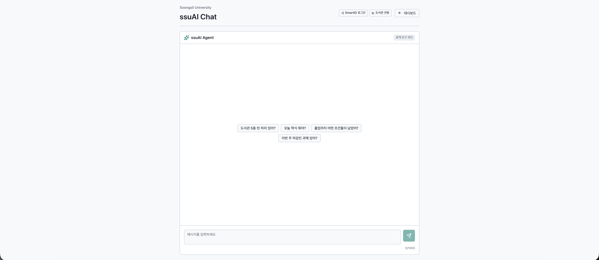

# ssuAI — 숭실대학교 AI 웹 클라이언트

[](https://github.com/ghdtjdwn/ssuAI/actions/workflows/ci.yml)

> 🇺🇸 English version: [README.en.md](README.en.md)

> 🧩 **숭실대 캠퍼스 AI 플랫폼** (4-서비스 중 하나) · [ssuMCP](https://github.com/ghdtjdwn/ssuMCP) · **ssuAI** · [ssuAgent](https://github.com/ghdtjdwn/ssuAgent) · [ssu-ai-service](https://github.com/ghdtjdwn/ssu-ai-service) · 🟢 [Live](https://ssuai.vercel.app)

숭실대학교 MCP 서버 [ssuMCP](https://github.com/ghdtjdwn/ssuMCP)를 소비하는 Next.js 웹 클라이언트.  
5개 화면(홈·챗봇·학사·도서관·캠퍼스)과 자연어 챗봇으로 공개 캠퍼스 정보와 개인 학사 정보를 조회한다.

| | URL |
|--|-----|
| 홈 (AI 브리핑 + 커스터마이즈 위젯) | <https://ssuai.vercel.app/> |
| 챗봇 | <https://ssuai.vercel.app/chat> |
| 학사 | <https://ssuai.vercel.app/academics> |
| 도서관 | <https://ssuai.vercel.app/library> |
| 캠퍼스 | <https://ssuai.vercel.app/campus> |

---

## 화면 구성 (2026-07-02 전면 리디자인 — [ADR 0010](docs/adr/0010-ui-redesign.md))

단일 디자인 시스템(숭실 블루 + 민트 토큰, Pretendard/JetBrains Mono, 시스템 추종 다크모드) 위에서 데스크톱은 사이드바+멀티컬럼, 모바일은 하단 탭바+단일 컬럼으로 레이아웃만 분기한다.

- **홈** — AI 오늘의 브리핑 히어로(연동 데이터 기반 요약) · 우선순위 카드 3 · 위젯 14종 커스터마이즈 그리드(순서/크기/표시/밀도, localStorage 영속)
- **챗봇** — SSE 스트리밍 + HITL 승인 카드(예약 등 실행 액션은 승인 후 실행)
- **학사** — 주간 시간표 그리드 · 졸업요건 · 성적 · 채플 · 장학 · LMS 과제 (u-SAINT 로그인)
- **도서관** — 실시간 좌석 3-뷰(도넛 오버뷰/공간/전체) · 좌석 추천→예약 · 대기 등록 · 대출 · 도서 검색
- **캠퍼스** — 학식(오늘/주간)·기숙사 식단 · 공지(카테고리 필터) · 시설 검색 · AI 근거 검색 진입

> 홈·학사·도서관·챗봇은 리디자인 후 캡처로 교체 완료. 캠퍼스 캡처는 실제 화면 갱신 시 추가한다.


| 도서관 좌석 실시간 현황 (도넛 그리드) | 학사 — 졸업요건 · 누적성적 · 채플 |
|---|---|
|  |  |



> 챗봇에서 *"도서관 자리 예약해줘"* 처럼 학교 상태를 바꾸는 액션은 로그인 후 HITL 승인 카드로 한 번 더 확인하고 실행한다.

---

## 왜 만들었나

[ssuMCP](https://github.com/ghdtjdwn/ssuMCP)가 MCP 서버로 학교 데이터를 제공하지만, Claude Desktop이 없는 사람도 쓸 수 있어야 했다. 브라우저에서 바로 접근할 수 있는 챗봇과 대시보드를 만들어 ssuMCP의 웹 클라이언트로 만든 게 ssuAI다.

---

## 아키텍처

```
브라우저
   ├─ 공개 GET/SSE ────────────────┐
   │                                ▼
   │             ssuMCP (Spring Boot, https://ssumcp.duckdns.org)
   │                                │ REST API
   │                                ▼
   │             학교 시스템 (학식 · 도서관 · LMS · u-SAINT)
   │                                ▲
   └─ 인증/세션 /api/* · /api/agent/* (same-origin)
       ▼
      Next.js 서버 (Vercel)
       ├─ /api/*        → rewrites ───────────────┘
       └─ /api/agent/*  → proxy (X-Agent-Key 주입) → ssuAgent
                                                     │ MCP
                                                     └──────────→ ssuMCP
```

브라우저는 로그인 없는 공개 조회(학식·기숙사 식단, 공지, 시설, 학사일정, 도서관 좌석 상태/도서 검색)와 공개 좌석 SSE만 backend origin으로 직접 호출한다(ADR 0087). SmartID/LMS Bearer, refresh cookie, library session, 예약/대출, MCP web session, `/api/agent/*` 챗봇 stream은 계속 same-origin 프록시를 탄다. Backend CORS는 공개 GET/SSE에만 열리고 credentials는 꺼져 있어, API 키·에이전트 키·세션이 브라우저 cross-origin 호출로 확장되지 않는다.

---

## 기능

### 공개 조회 (로그인 불필요)

- 학생식당·기숙사 식단 (오늘/날짜별/주간)
- 교내 시설 검색
- 중앙도서관 소장 도서 검색
- 학교·학과 공지사항 (목록, 검색, 상세, 진행 중 공지)

### 연동 후 개인 조회

| 연동 | 기능 |
|------|------|
| SAINT (SmartID SSO) | 시간표, 성적, 채플 출석, 졸업 요건, 장학금 |
| LMS (Canvas SSO) | 과제·퀴즈 목록 |
| 도서관 | 층별 좌석 현황, 본인 대출 현황 |

### 챗봇

대시보드와 동일한 데이터 범위에 대해 자연어로 질문할 수 있다. 공개 질문은 즉시 응답하고, 개인 데이터 질문은 연동 세션이 있는 경우에만 응답한다.

`/chat`은 LangGraph 기반 멀티 에이전트(ssuAgent)와 SSE 스트리밍으로 연결된다. 에이전트 전환(Handoff)·도구 실행·텍스트가 실시간 표시되고, 도서관 예약처럼 학교 상태를 바꾸는 액션은 HITL 승인 카드(HitlCard)로 멈춰 사용자 승인 후 `/agent/resume`으로 재개한다.

### 도서관 좌석 예약 (플래그십)

좌석 예약·이석·반납은 backend MCP의 `prepare_* → confirm_action` 2단계 확인을 그대로 화면에 옮긴 UX로 제공한다:

- `SeatRecommendationPanel` — 선택한 층의 추천 좌석 5개 + 좌석별 예약 버튼
- `ReservationConfirmModal` — `prepare` 요약·만료 시간을 보여주고 사용자가 한 번 더 확정해야 `confirm` 호출. confirm 결과는 `SUCCESS`(예약 완료) / `PROCESSING`(동기 confirm이 타임아웃됐지만 백엔드 워커가 백그라운드에서 예약을 이어 처리 — "백그라운드에서 처리 중" 안내, 실패로 보지 않음) / 그 외 실패(`FAILED_RACE`·`TIMEOUT`·`FAILED_AUTH`·`FAILED_UPSTREAM` → "예약 실패" 안내)로 분기한다
- `WaitStatusCard` — 활성 대기(`wait_for_library_seat`) intent의 상태·시도 횟수·만료·취소 버튼

민감한 write action을 "사용자 명시 승인 후에만 실행"하는 설계를 코드와 화면으로 동시에 증명한다.

---

## 인증 흐름

```
SAINT (SmartID SSO)
  로그인 버튼 → /api/auth/saint/sso → SmartID 리다이렉트
  → 콜백 → JWT 발급 (access: 메모리, refresh: HttpOnly 쿠키 14일)

LMS (Canvas SSO)
  로그인 버튼 → /api/auth/lms/sso → Canvas 리다이렉트
  → 콜백 → LMS 세션 연결

도서관
  /mcp/auth/library → 자격증명 입력
  → ssuMCP가 도서관 API 토큰 확보 → 세션 연결
```

Access token은 메모리(`AuthContext`)에만 보관한다. localStorage/sessionStorage에 쓰지 않는다. 새로고침 시 `/api/auth/refresh`로 HttpOnly 쿠키의 refresh token을 써서 자동 재발급한다.

---

## 엔지니어링 노트

### SSO 콜백 쿠키 유실 — 4개 레이어에 분산된 문제

SmartID 로그인 후 세션 쿠키가 계속 누락되는 증상이 있었다. 원인이 한 곳이 아니라 4개 레이어에 걸쳐 있었다.

1. **Cross-origin 쿠키**: 브라우저가 `ssuai.vercel.app`의 응답으로 `ssumcp.duckdns.org` 쿠키를 저장하지 않음 → Next.js `rewrites`로 same-origin proxy 구축
2. **302 redirect Set-Cookie 누락**: SSO callback이 302를 반환할 때 프록시가 중간 Set-Cookie를 버림 → callback을 200 + HTML로 변경
3. **App Router route intercept 순서**: `afterFiles` rewrite가 App Router route handler보다 먼저 실행돼 쿠키를 재발급할 수 없었음 → Next.js 16 middleware(`proxy.ts`)로 이전
4. **Next.js 16 Set-Cookie silent strip**: `response.headers.set('Set-Cookie', ...)` 방식을 Next.js 16이 조용히 제거 → `response.cookies.set()` API로 교체

각 단계를 커밋 단위로 격리해서 수정했다. 레이어마다 고치면 다음 레이어가 드러나는 구조였다.

### Same-origin Proxy

브라우저가 직접 ssuMCP를 호출하면 CORS 설정이 복잡해지고, API 키·세션 토큰이 Network 탭에 노출된다. `next.config.ts`의 `rewrites`로 `/api/*`를 ssuMCP로 투명하게 전달해 이 문제를 원천 차단했다.

### TanStack Query

서버 상태 캐싱, 리트라이, 백그라운드 재검증을 TanStack Query에 위임했다. 컴포넌트는 `useQuery`·`useMutation` 훅만 호출하고, 캐시 관리 코드를 직접 작성하지 않는다. `staleTime`으로 학교 서버 부하를 줄이고, 네트워크 불안정 시 자동 리트라이로 UX를 보호한다.

---

## 기술 스택

| 분류 | 기술 |
|------|------|
| 프레임워크 | Next.js 16 (App Router) + TypeScript 6 |
| 서버 상태 | TanStack Query v5 |
| UI | Tailwind CSS 3, shadcn/ui, Radix UI |
| 테스트 | Vitest 4, Testing Library |
| 패키지 매니저 | pnpm |
| 배포 | Vercel |

---

## 프로젝트 구조

```
app/
  auth/         # SSO 콜백, 로그인 페이지
  chat/         # 챗봇 UI
  mcp/auth/     # 도서관 세션 UI
components/     # 기능별·공통 UI 컴포넌트
contexts/       # 도서관 인증 컨텍스트 (LibraryAuthContext)
hooks/          # TanStack Query 훅 + u-SAINT 인증(useSaintAuth·프로바이더) · 세션 가드
lib/
  api/          # 타입 안전 API 클라이언트
  api/client.ts # fetch 래퍼 — envelope 파싱, ApiError
docs/           # 제품 문서, 아키텍처, ADR
```

---

## 로컬 개발

```bash
cp .env.example .env.local
# NEXT_PUBLIC_SSUAI_API_BASE=https://ssumcp.duckdns.org
pnpm install
pnpm dev        # http://localhost:3000
```

로컬 ssuMCP 없이도 프로덕션 서버(`https://ssumcp.duckdns.org`)를 가리키면 바로 동작한다.

### 검증

```bash
pnpm lint
pnpm typecheck
pnpm test
pnpm build
```

---

## 환경 변수

| 변수 | 설명 |
|------|------|
| `NEXT_PUBLIC_BACKEND_ORIGIN` | 공개 REST 조회와 도서관 좌석 SSE의 직접 호출 대상. 미설정 시 `NEXT_PUBLIC_SSUAI_API_BASE` → same-origin 순으로 폴백 |
| `NEXT_PUBLIC_SSUAI_API_BASE` | ssuMCP 서버 URL. `/api/*` rewrite 대상의 legacy public env이며, `NEXT_PUBLIC_BACKEND_ORIGIN` 미설정 시 공개 직접 호출 fallback |
| `SSUAI_API_PROXY_TARGET` | (서버 전용) `/api/*` 프록시 대상 오버라이드. 설정 시 `NEXT_PUBLIC_SSUAI_API_BASE`보다 우선 |
| `SSUAGENT_BASE_URL` | (서버 전용) `/api/agent` 프록시가 전달하는 ssuAgent 서버 URL. 미설정 시 `NEXT_PUBLIC_SSUAGENT_BASE_URL` → `https://ssuagent.duckdns.org` 순으로 폴백 |
| `NEXT_PUBLIC_SSUAGENT_BASE_URL` | (공개·레거시) ssuAgent 서버 URL 폴백값. 주로 로컬 개발용 |
| `AGENT_API_KEY` | (서버 전용·운영 필수) `/api/agent` 프록시가 ssuAgent 호출 시 주입하는 `X-Agent-Key` 자격증명. ssuAgent의 값과 일치해야 하며 브라우저에는 노출되지 않음. 로컬에서 양쪽 게이트를 끈 경우에만 생략 가능 |

---

## 문서

- [제품 현황 및 범위](docs/product.md)
- [장기 비전과 로드맵](docs/vision.md)
- [보안 정책 (ssuMCP)](https://github.com/ghdtjdwn/ssuMCP/blob/main/docs/security.md)

---

## MCP 서버

이 앱이 소비하는 MCP 서버:  
**[ghdtjdwn/ssuMCP](https://github.com/ghdtjdwn/ssuMCP)** · `https://ssumcp.duckdns.org/mcp`

---

## 라이선스

MIT — [LICENSE](LICENSE)
