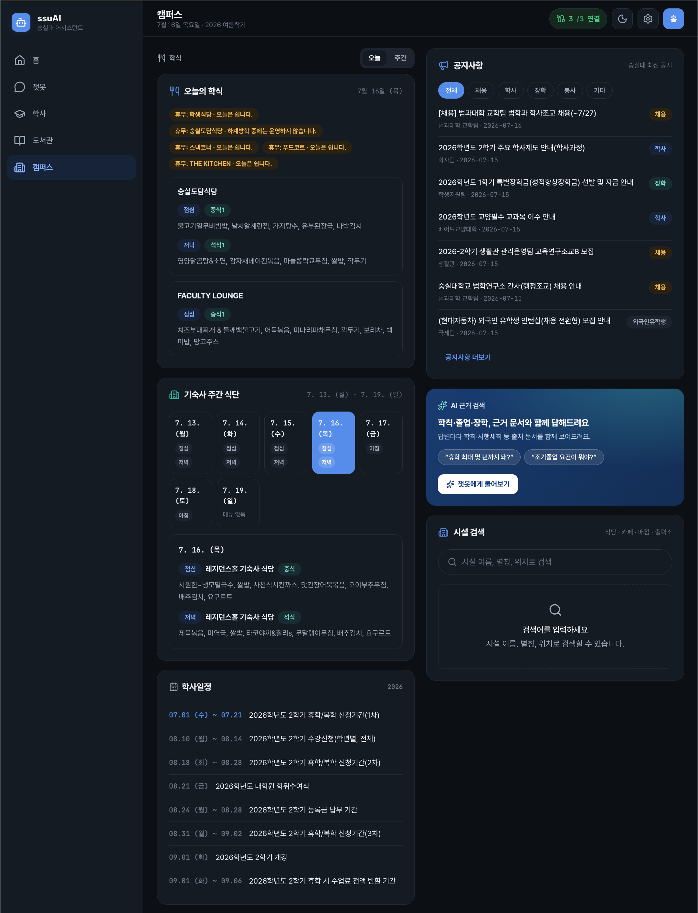
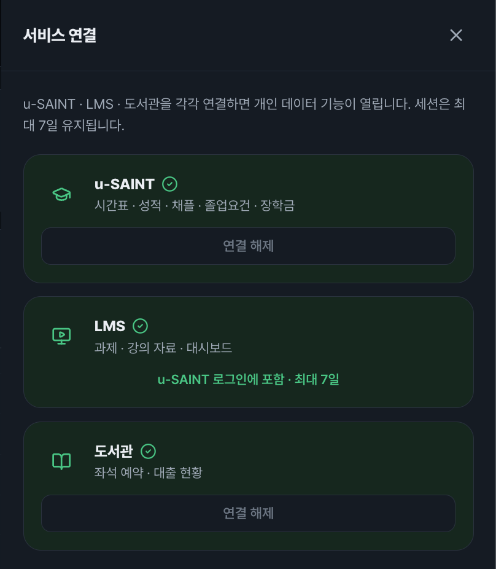
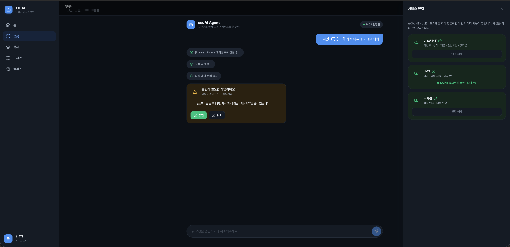
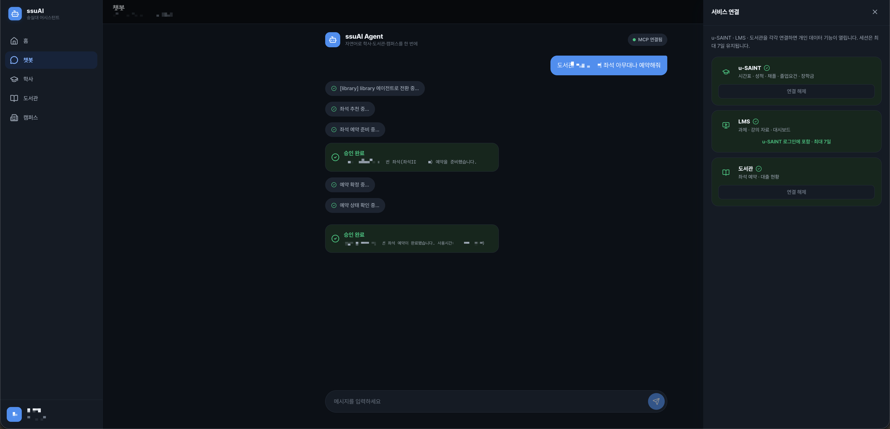

# ssuAI

[](https://github.com/ghdtjdwn/ssuAI/actions/workflows/ci.yml)
[](https://github.com/ghdtjdwn/ssuAI/actions/workflows/security.yml)

**한국어** · [English](README.en.md)

공개 캠퍼스 정보, 개인 학사·LMS·도서관 데이터, 승인 기반 AI 작업을 하나의 웹 경험으로 연결한
Next.js 애플리케이션이다. 브라우저에 비밀 값을 노출하지 않으면서 대시보드와 SSE 챗봇을 제공한다.

[라이브 앱](https://ssuai.vercel.app) · [챗봇](https://ssuai.vercel.app/chat) ·
[플랫폼 사례 연구](https://seongju.vercel.app/projects/ssu-platform/) · [문서 지도](docs/README.md)


## 플랫폼에서 맡는 역할

| 서비스 | 책임 | 저장소 |
| --- | --- | --- |
| **ssuAI** | **사용자 화면, same-origin BFF, 인증 상태와 SSE/HITL UX** | 현재 저장소 |
| ssuAgent | LangGraph 라우팅, 대화 상태, HITL 오케스트레이션 | [ghdtjdwn/ssuAgent](https://github.com/ghdtjdwn/ssuAgent) |
| ssuMCP | 캠퍼스 도메인 로직, MCP/REST 계약, 인증과 상태 변경 | [ghdtjdwn/ssuMCP](https://github.com/ghdtjdwn/ssuMCP) |
| ssu-ai-service | 격리된 임베딩 요청 게이트웨이 | [ghdtjdwn/ssu-ai-service](https://github.com/ghdtjdwn/ssu-ai-service) |

이 저장소는 프론트엔드와 BFF 경계만 소유한다. 학교 시스템 연동과 데이터 정합성은 `ssuMCP`,
자연어 라우팅과 대화 checkpoint는 `ssuAgent`의 책임이다.

## 제품 흐름

| 사용자 경로 | 제공 기능 | 신뢰 경계 |
| --- | --- | --- |
| 공개 조회 | 학식, 공지, 시설, 학사일정, 도서 검색, 실시간 좌석 현황 | credential 없는 GET/SSE만 backend origin으로 직접 호출 가능 |
| 연결된 대시보드 | 시간표, 성적, 졸업요건, 채플, 장학, LMS 과제, 대출 | access token은 메모리, refresh와 provider session은 same-origin 경로 |
| AI 챗봇 | 도메인 handoff, 도구 진행 상태, 스트리밍 답변 | 서버 route가 agent key와 검증된 principal을 주입 |
| 상태 변경 | 좌석 예약·반납, LMS 자료 내보내기 | `prepare` 결과를 보여준 뒤 사용자 승인으로만 `resume/confirm` |

홈, 학사, 도서관, 캠퍼스, 챗봇은 데스크톱 사이드바와 모바일 하단 탐색을 공유한다. 디자인 결정과
접근성 기준은 [UI redesign ADR](docs/adr/0010-ui-redesign.md)에 기록했다.

<details>
<summary>화면 더 보기</summary>

실명과 개인 학사·재정·대출·좌석 값은 공개 이미지에서 비식별화했다.

| 도서관 실시간 좌석 | 학사 대시보드 |
| --- | --- |
|  |  |

| 캠퍼스 정보 | 서비스 연결 상태 |
| --- | --- |
|  |  |

| 좌석 예약 승인 요청 | 승인 후 완료 |
| --- | --- |
|  |  |

</details>

## 아키텍처


공개 GET/SSE는 선택적으로 backend origin을 직접 호출해 Vercel 함수 hop을 줄인다. 쿠키·Bearer·API
key가 필요한 요청과 `/api/agent/*`는 항상 same-origin 서버 경로를 통과한다. 이 분리는 public CORS를
인증 surface로 확장하지 않으면서도 공개 데이터의 지연을 줄인다. 상세 흐름은
[프론트엔드 아키텍처](docs/architecture.md)에 있다.

## 엔지니어링 근거

| 문제 | 구현과 검증 근거 |
| --- | --- |
| 공개 성능 최적화가 인증 경계를 넓힐 위험 | 공개 GET/SSE allow-list와 server-only proxy 분리 — [ADR 0087](docs/adr/0087-public-direct-origin-sse.md) · [boundary tests](lib/api/public-origin.test.ts) |
| SSO redirect에서 브라우저 쿠키가 유실되는 문제 | 1회용 code를 200 응답에서 교환 — [ADR 0089](docs/adr/0089-sso-code-exchange.md) · [return-page tests](app/auth/return/page.test.tsx) |
| UI 연결 표시와 실제 MCP 권한의 불일치 | backend grant를 단일 근거로 사용하고 session 발급을 single-flight 처리 — [ADR 0099](docs/adr/0099-authoritative-web-session-grants.md) |
| 스트림 중단 뒤 HITL 상태 또는 최종 링크 유실 | thread-stable SSE, resume endpoint, 제한된 안전 링크 렌더링 — [chat tests](components/chat/ChatPanel.test.tsx) · [message tests](components/chat/MessageBubble.test.tsx) |
| 브라우저가 agent key나 principal을 조작할 위험 | server route가 bearer를 검증하고 신뢰 값만 전달 — [agent proxy](lib/server/agentProxy.ts) · [proxy tests](lib/server/agentProxy.test.ts) |
| 변경이 UI에서만 우연히 동작하는 문제 | lint, TypeScript, Vitest, production build를 모두 요구 — [CI workflow](.github/workflows/ci.yml) |

주요 스택은 Next.js 16, React 19, TypeScript 6, TanStack Query, Tailwind CSS, Radix UI,
Vitest, Testing Library, Playwright, axe-core와 Vercel이다.

## 로컬 실행과 검증

Node.js 20과 pnpm 10을 사용한다. 로컬 backend 없이 공개 ssuMCP를 대상으로 실행할 수도 있다.

```bash
git clone https://github.com/ghdtjdwn/ssuAI.git
cd ssuAI
cp .env.example .env.local
pnpm install --frozen-lockfile
pnpm dev
```

로컬 ssuMCP 없이 공개 backend를 사용할 때는 `.env.local`의 active localhost 값을 다음처럼 바꾼다.

```dotenv
NEXT_PUBLIC_SSUAI_API_BASE=https://ssumcp.duckdns.org
NEXT_PUBLIC_BACKEND_ORIGIN=https://ssumcp.duckdns.org
```

```bash
pnpm lint
pnpm typecheck
pnpm test
pnpm build
pnpm exec playwright install chromium
pnpm test:e2e
```

`test:e2e`는 데스크톱과 모바일 Chromium에서 핵심 5개 화면의 탐색 가능성, WCAG 2.0/2.1 A·AA
중 critical/serious axe 위반, 홈 화면의 실험실 LCP 2.5초·CLS 0.1 예산을 검사한다. 학교 API
요청은 503 fixture로 차단하므로 실제 학생 데이터나 외부 시스템 상태를 건드리지 않는다. 검증
서버는 기본적으로 새로 기동하며, 의도적으로 실행 중인 ssuAI 서버를 검사할 때만
`E2E_REUSE_SERVER=true`를 설정한다. 실패 시 trace·화면·Web Vitals JSON이 test artifact로 남는다.

이 검증은 로컬 production build의 회귀 게이트이지 실사용자 네트워크의 현장 RUM, 인증 여정 또는
학교 시스템 가용성의 증거가 아니다. 서비스별 실험 조건과 운영 주장 한계는
[`docs/portfolio-verification-boundary.md`](docs/portfolio-verification-boundary.md)에 기록했다.
2026-07-18에 전이 의존성 패치 버전을 고정하고 확인한 `pnpm audit` 0건도 당시 registry advisory
스냅샷이며 런타임 침투 테스트를 뜻하지 않는다.

환경 변수와 server-only/public 구분은 [`.env.example`](.env.example)에 있다. 운영 proxy target과
secret 변경은 Vercel 설정과 함께 검증해야 하며, localhost 기본값으로 운영 구성을 추정하지 않는다.

## 문서

- [문서 지도](docs/README.md)
- [제품 범위](docs/product.md)
- [프론트엔드 아키텍처](docs/architecture.md)
- [보안 경계](docs/security.md)
- [검증 범위와 주장 한계](docs/portfolio-verification-boundary.md)
- [ADR 목록](docs/adr/)
- [ssuMCP의 MCP 도구 계약](https://github.com/ghdtjdwn/ssuMCP/blob/main/docs/mcp-tools.md)

## 범위와 제약

- 숭실대학교 공식 서비스가 아니며, 외부 학교 시스템의 가용성을 보장하지 않는다.
- 개인 화면과 상태 변경은 유효한 학교 계정 및 provider 연결이 필요하다.
- CI는 코드의 빌드·테스트를 검증하며 Vercel 환경 변수나 외부 서비스의 종단 동작까지 증명하지 않는다.

## 라이선스

[MIT](LICENSE)
