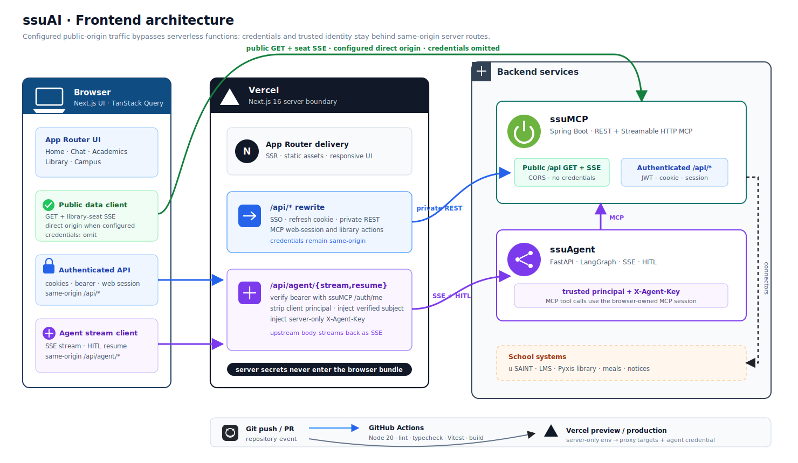

# ssuAI 프론트엔드 아키텍처

> 이 문서는 브라우저와 Vercel의 프론트엔드 경계를 설명한다. 서버 내부 구조의 기준 문서는 [ssuMCP 아키텍처](https://github.com/ghdtjdwn/ssuMCP/blob/main/docs/architecture.md)다.

## 전체 구성

[PNG 버전](assets/architecture.png)

## 런타임 경계

ssuAI는 요청의 자격증명 요구 여부에 따라 세 경로를 사용한다.

1. 공개 GET과 도서관 좌석 SSE는 `NEXT_PUBLIC_BACKEND_ORIGIN`(legacy fallback: `NEXT_PUBLIC_SSUAI_API_BASE`)이 설정된 배포에서 ssuMCP로 직접 전송한다. 쿠키와 Bearer token을 보내지 않아 공개 트래픽이 Vercel Function을 점유하지 않는다. 두 public 변수가 모두 없으면 base URL이 빈 문자열이 되어 same-origin `/api/*`로 폴백한다([ADR 0087](adr/0087-public-direct-origin-sse.md)).
2. SSO, refresh cookie, 개인 학사·LMS·도서관 데이터, 예약, MCP web session은 same-origin `/api/*`로 호출한다. `next.config.ts`의 server-side rewrite가 ssuMCP로 전달한다.
3. 챗봇의 `/api/agent/{stream,resume}`는 전용 Route Handler가 처리한다. 이 경로는 브라우저가 보낸 `principal`을 제거하고, Bearer token을 ssuMCP `/api/auth/me`로 검증한 결과만 다시 주입한다. 이어 서버 전용 `X-Agent-Key`를 추가해 ssuAgent를 호출하고 upstream SSE body를 그대로 스트리밍한다([ADR 0086](adr/0086-server-side-principal.md)).

이 분리는 공개 읽기 성능과 인증 경계를 함께 유지한다. 브라우저 bundle에는 agent key나 server-only target이 포함되지 않는다.

## 인증과 세션

- SmartID SSO는 callback의 일회용 authorization code를 same-origin API에서 교환한다. 중복 effect가 같은 code를 두 번 소비하지 않도록 guard한다([ADR 0089](adr/0089-sso-code-exchange.md)).
- Access token은 메모리에 두고 refresh token은 HttpOnly cookie로 유지한다.
- MCP web session의 `linkedProviders`가 SAINT·LMS·LIBRARY 연결 상태의 유일한 기준이다. 발급·만료·live grant 재검증은 앱 수준 provider가 단일 소스로 관리한다([ADR 0099](adr/0099-authoritative-web-session-grants.md)).
- `thread_id`, `mcp_session_id`, 검증된 principal은 목적이 다르다. thread는 대화 식별자, MCP session은 private tool 권한, principal은 ssuAgent의 안정된 소유권 바인딩에 사용한다.

## 배포와 검증

애플리케이션은 Vercel에 배포한다. GitHub Actions는 Node 20에서 `pnpm lint`, `pnpm typecheck`, `pnpm test`, `pnpm build`를 실행한다. 운영 프록시 대상과 `AGENT_API_KEY`는 Vercel의 server-only 환경 변수로 주입하며 브라우저 공개 변수로 복제하지 않는다.

프론트엔드 CI는 코드 품질과 build를 검증한다. 실제 운영 배선은 Vercel 환경 변수, ssuMCP 공개 CORS, ssuAgent API key가 서로 일치해야 완성된다.
